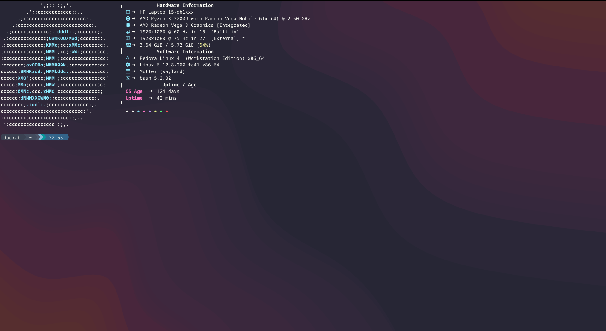

# 🦇 Dracula-Inspired Ghostty Configuration

A sleek and modern terminal configuration for Ghostty featuring a custom Dracula-inspired color scheme, optimized for both aesthetics and functionality.

## 📸 Screenshots

Here's how your terminal will look with this configuration:

### Full Terminal View

*Full terminal view showing the Dracula theme and transparency effects*

## ✨ Features

- 🎨 Beautiful Dracula-inspired color scheme
- 🔲 Borderless window design
- 🌓 Dark theme with elegant transparency
- 🖱️ Smart mouse behavior
- 📝 MesloLGDZ font optimization
- 🎯 Block cursor style
- 🖥️ Full HD window preset

## 🚀 Quick Installation

```bash
mkdir -p ~/.config/ghostty && curl -o ~/.config/ghostty/config https://raw.githubusercontent.com/dacrab/ghostty-config/main/ghostty-config
```

## 🛠️ Configuration Details

### Window Settings
- Borderless design for a modern look
- Inherits working directory
- Dark theme
- State persistence
- Full HD resolution (1920x1080)

### Mouse Behavior
- Auto-hide while typing
- Copy-on-select enabled

### Visual Settings
- Background: Dark (#282a36) with 70% opacity
- Font: MesloLGDZ at 11pt
- Block cursor style

### Color Palette
The configuration uses a carefully curated Dracula-inspired color scheme:

| Color Purpose    | Hex Code |
|-----------------|----------|
| Background      | #282a36  |
| Foreground      | #f8f8f2  |
| Selection       | #44475a  |
| Cursor          | #f8f8f2  |

Plus a full 16-color ANSI palette optimized for visibility and aesthetics.

## 🔄 Manual Installation

If you prefer to manually set up the configuration:

1. Open your Ghostty configuration file:
   ```bash
   nano ~/.config/ghostty/config
   ```

2. Copy and paste the entire configuration block below:
   ```conf
# Window settings
window-decoration = false
window-inherit-working-directory = true
window-theme = dark
window-save-state = always
window-width = 1920
window-height = 1080

# Mouse settings
mouse-hide-while-typing = true
copy-on-select = true

# Background and transparency settings
background = #282a36
background-opacity = 0.7

# Font and cursor settings
font-family = MesloLGDZ
font-size = 11
cursor-style = block

# Color scheme (Dracula-inspired dark theme)
foreground = #f8f8f2
selection-foreground = #ffffff
selection-background = #44475a
cursor-color = #f8f8f2

# ANSI Colors (Dracula)
palette = 0=#21222c
palette = 1=#ff5555
palette = 2=#50fa7b
palette = 3=#f1fa8c
palette = 4=#bd93f9
palette = 5=#ff79c6
palette = 6=#8be9fd
palette = 7=#f8f8f2
palette = 8=#6272a4
palette = 9=#ff6e6e
palette = 10=#69ff94
palette = 11=#ffffa5
palette = 12=#d6acff
palette = 13=#ff92df
palette = 14=#a4ffff
palette = 15=#ffffff
   ```

## 📝 Notes

- Ensure you have Ghostty installed before applying this configuration
- The MesloLGDZ font should be installed on your system
- Adjust the opacity and window size values to match your preferences

## 🤝 Contributing

Feel free to fork this configuration and customize it to your needs. Pull requests for improvements are welcome!

## 📜 License

This configuration is released under the MIT License. Feel free to use and modify it as you wish.
